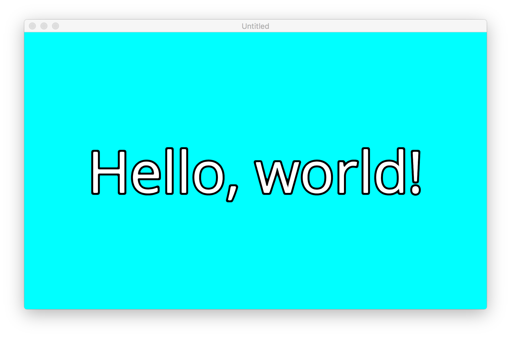

# :sparkles: OkUI :sparkles:

OkUI is an OpenGL-based framework for creating portable user interfaces, with a focus on performance and portability. We think it's pretty okay. :ok_hand:

* [Features](#features)
* [Platform Support](#platform-support)
* [Quick Start](#quick-start)
    * [Compiling](#compiling)
    * [Hello World](#hello-world)
    * [Project Structure](#project-structure)
* [Generating Bitmap Fonts](#generating-bitmap-fonts)
* [Generating SDF Images](#generating-sdf-images)

## Features

* :rocket: **Fast**: Intelligently caches and efficiently renders views to ensure that your UI remains fast regardless of complexity. If you aren't getting 60 FPS on anything remotely modern, open an issue.
* :handbag: **Portable**: At its core, OkUI is a collection of OpenGL abstractions and shaders. Supporting new platforms should require very few code changes.
* :dizzy: **Markup Language**: Implement interfaces with an XML language instead of code. You'll still get the same great performance, but be able to iterate on designs without recompiling or remotely deploy interface updates!
* :spades: **Distance Field Rendering**: Render icons, glyphs, and text with signed distance fields that scale beautifully to large sizes and enable effects such as outlines and glows. [See the Valve paper](http://www.valvesoftware.com/publications/2007/SIGGRAPH2007_AlphaTestedMagnification.pdf).

## Platform Support

Officially, Android, iOS, tvOS, and MacOS are supported, but it can probably be made to work on anything that you can build for in a linux-like environment. Official Windows support is a work-in-progress.

## Quick Start

#### Compiling

First, make sure you initialize all of the submodules: `git submodule update --recursive --init`

We use a three-step build system:

* :package: `./build-deps` will download and build all of OkUI's dependencies.
* :clipboard: `./configure` will generate some essential build files based on your environment and the result of the previous step.
* :boom: `./b2` will build the library. If you'd like, you can install it via `./b2 install --prefix=./my/okui/destination`. See the [Boost.Build documentation](http://www.boost.org/build/) for more help.

#### Hello World

There is a "hello world" project in the examples directory. You can compile it like so:

`./b2 ./examples/hello-world`

The output binary will be placed in *examples/hello-world/bin*:

`$(find examples/hello-world/bin -name hello-world)`

This will open up a new window that renders the text "Hello, world!" using a signed distance field bitmap font:



#### Project Structure

Generally, projects that use OkUI are structured like this:

```c++
int main(int argc, const char* argv[]) {
    /**
    * All application state is managed by an object that implements
    * okui::Application. This application class is where you customize
    * application-wide behavior including such as resource management and
    * rendering engine.
    */
    MyApplication application;

    /**
    * Windows are implementations of okui::Window. They create the OpenGL view
    * that your UI will be rendered in.
    */
    MyWindow window{&application};
    window.open();

    /**
    * okui::Application::run executes the main run loop and returns only when
    * the application is shutting down.
    */
    application.run();

    return 0;
}
```

Once you have a window, you can implement your UI by creating instances of `okui::View`. They follow this sort of structure:

```c++
class MyView : public okui::View {
public:
    /**
    * Constructors can create and add subviews.
    */
    MyView() {
        _logo.setTexture("logo.png");
        addSubview(&_logo);
    }

    /**
    * The okui::View::layout method can be overridden to define the layout of
    * the view's subviews. This method is invoked whenever any ancestor is
    * resized and the layout may need to be recomputed.
    */
    virtual void layout() override {
        _logo.setBounds(0, 0, bounds().width, bounds().height);
    }
private:
    okui::views::ImageView _logo;
}
```

Your topmost views can be added to a window by adding them to the window's content view:

```c++
MyWindow(okui::Application* application) : okui::Window{application} {
    contentView()->addSubview(&myView);
}
```

See the examples directory for more sample code.

## Generating Bitmap Fonts

It's recommended that bitmap fonts be generated with Hiero, a tool distributed with [libGDX](https://github.com/libgdx/libgdx).

## Generating SDF Images

Distance field images can be generated by this tool:

https://github.com/Chlumsky/msdfgen

OkUI expects the distance field to be in the alpha channel, so you'll need to convert the output of
that to the alpha channel of a white image (In Pixelmator, all you have to do is double click the
"Mask to Alpha" effect.).
